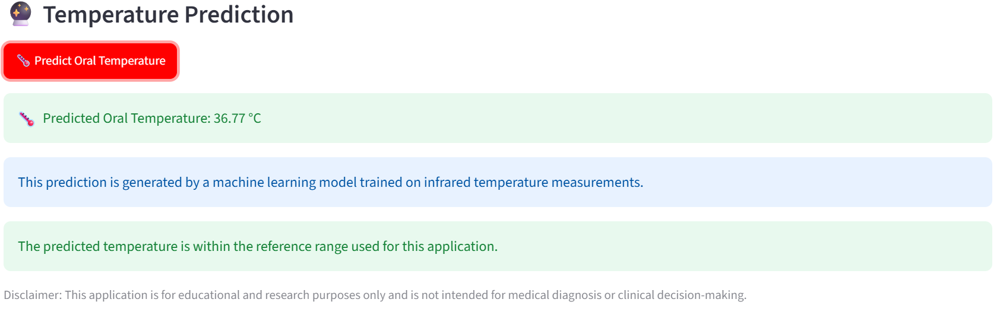
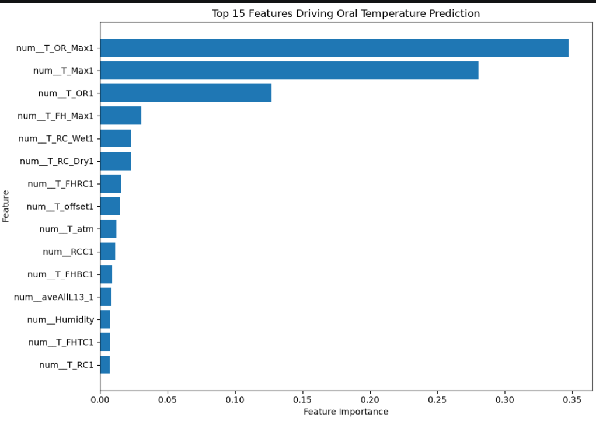
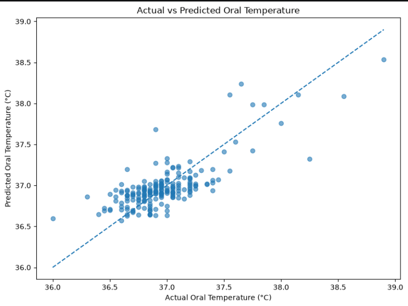

# Infrared Temperature Prediction

A machine learning project for predicting oral temperature using infrared facial temperature measurements and demographic information.

## Project Overview

This project develops a machine learning regression model capable of predicting oral temperature from infrared facial temperature measurements, environmental conditions, and demographic characteristics.

The project covers the complete machine learning workflow, including:

- Data understanding
- Data cleaning and preprocessing
- Exploratory Data Analysis (EDA)
- Feature engineering
- Model development
- Model comparison
- Hyperparameter tuning
- Feature importance analysis
- Model validation
- Model deployment with Streamlit

## Application Preview



## Feature Importance

The model identified infrared temperature measurements as the most influential features for predicting oral temperature.



## Actual vs Predicted

The chart compares the model's predicted oral temperature values with the actual observed values. Predictions closer to the diagonal line indicate better model performance.



## Problem Statement

Traditional oral temperature measurement requires direct contact with the individual and may not always be convenient in situations where rapid or contactless screening is desirable.

This project investigates whether infrared facial temperature measurements and related environmental and demographic features can be used to predict oral temperature using machine learning.

The objective is to develop a regression model that can estimate oral temperature from these available features.

## Dataset

The dataset contains infrared temperature measurements collected from individuals together with demographic and environmental information.

### Features

The dataset includes:

- Gender
- Age
- Ethnicity
- Atmospheric temperature (`T_atm`)
- Humidity
- Distance
- Temperature offset
- Facial infrared temperature measurements
- Regional facial temperature measurements
- Oral temperature measurements

### Target Variable

The target variable used for prediction is:

`aveOralF`

representing the average oral temperature.

## Model Performance

Several regression algorithms were evaluated during baseline model development, including:

- Linear Regression
- Ridge Regression
- Lasso Regression
- Decision Tree Regressor
- Random Forest Regressor
- Gradient Boosting Regressor

Gradient Boosting Regressor achieved the strongest baseline performance.

### Final Evaluation

| Metric | Score |
|---|---:|
| MAE | 0.1657 °C |
| RMSE | 0.2178 °C |
| R² | 0.6059 |

The model achieved an R² score of approximately 0.61, indicating that it explains a substantial portion of the variation in oral temperature within the test dataset.

## Feature Importance

Feature importance analysis showed that infrared facial temperature measurements were among the most influential predictors of oral temperature.

The most influential features included:

1. `T_OR_Max1`
2. `T_Max1`
3. `T_OR1`
4. `T_FH_Max1`
5. `T_RC_Wet1`
6. `T_RC_Dry1`
7. `T_FHRC1`
8. `T_offset1`
9. `T_atm`
10. `RCC1`

These results suggest that facial infrared temperature measurements provide important information for estimating oral temperature.

## Streamlit Application

A Streamlit web application was developed to allow users to enter infrared temperature measurements and demographic information and receive an estimated oral temperature.

### Application Workflow

User Input
↓
Data Preprocessing
↓
Trained Machine Learning Pipeline
↓
Oral Temperature Prediction

The application uses the saved machine learning pipeline:

`models/infrared_temperature_pipeline.pkl`

## How to Run the Application

### 1. Clone the Repository

```bash
git clone https://github.com/vera2016-cpu/infrared-temperature-prediction.git
cd infrared-temperature-prediction

# Create and Activate a Virtual Environment
# Windows
python -m venv .venv
.venv\Scripts\activate
# macOS / Linux
python3 -m venv .venv
source .venv/bin/activate

# Install Dependencies
pip install -r requirements.txt

# Run the Streamlit Application
streamlit run app/app.py